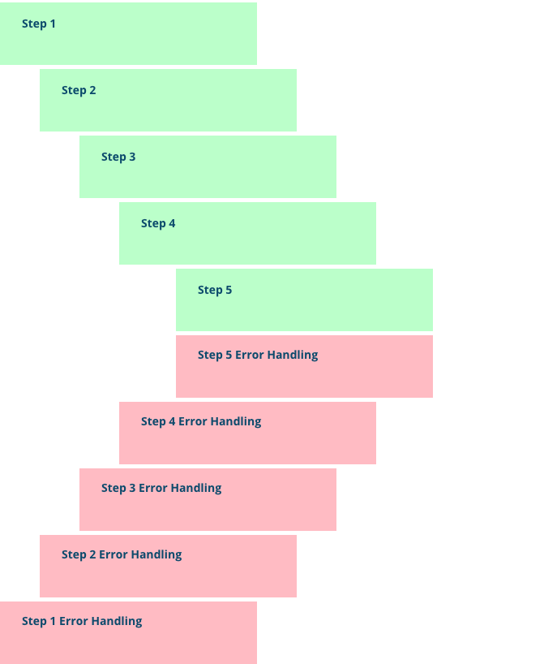

# Callbacks to Async Await

There are 3 ways to handle code that takes time, such as aws-sdk calls:
- callbacks
- promises
- async await

In the context of serverless backend lambda functions, we find async await can greatly increase the
readablity of code and help us avoid what is known in the NodeJS communit as 'the pyramid of doom'. 

### What is the pyramid of doom?
If we have 1 step our code with zero aws calls, our code straitforward:

Once we add a callback, you will notice that you end up indenting all further code. The rest of our code
will need the result of the first aws call, so all code will be inside of a callback and will be indented once.

If we have 4 aws calls in our function, we will need to intend 4 times:

We also need to make sure we handle potential errors. In the case where there are no callbacks, this is very straightforward:

But if we have 1 callback, we need to handle errors at the root level, and errors potentially resulting from the callback.

And if we are errorhandling properly on a function involving 4 callbacks:

This shape we see in the last example is the `pyramid of doom` and it is very common in NodeJS code because traditionally we only had callbacks to work with, and a backend function potentially is interacting with all kinds of resources.

Our code and business logic will probably already have enough necessary indentation from the result of conditional statements like ifs and loops. Thankfully with the maturing of NodeJS, features like promises and async await have made callback indentation avoidable. 

What we would like to see instead would something like this:

