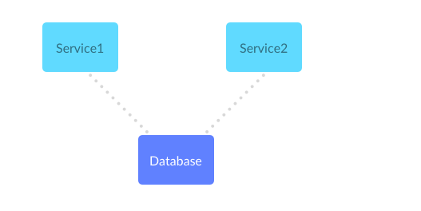
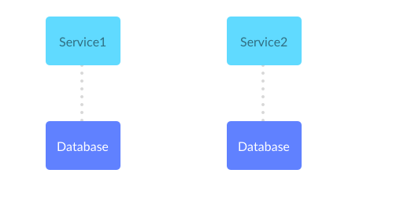

# Anti Pattern: Multiple services sharing databases

When 2 services read and write to the same database,
they must do it in the same way.

If both service do not keep their changes in sync, it is possible to
write differently formatted data to the database, which will cause hard
to debug bugs down the road.

In order to avoid this, we can sync every change with the other service, but this means they are tightly coupled. A better solution would either be to combine both services into one:

Or have a dedicated database for each service:

## Special notes on this anit pattern
Sometimes a set of applications needs to have common data defined, such as `error codes` or `default config`. One way to overcome this common dependency is to have a service dedicated to these shared resources. Whenever any change happens to `error codes` for example, this service can emit an event (`SNS`, `EventBridge`). All other services interested in this change can listen for that event and record the change in their own dedicated database.

This optimizes for read rather than write. Having all other services make an api call to the shared common service might add too much time to overall execution. If `error codes` rarely changes, emitting an event when it does change and recording the change in each services database will ensure that there is no coupling, reads are optimized, and deployments of these services are much more straightforward.

