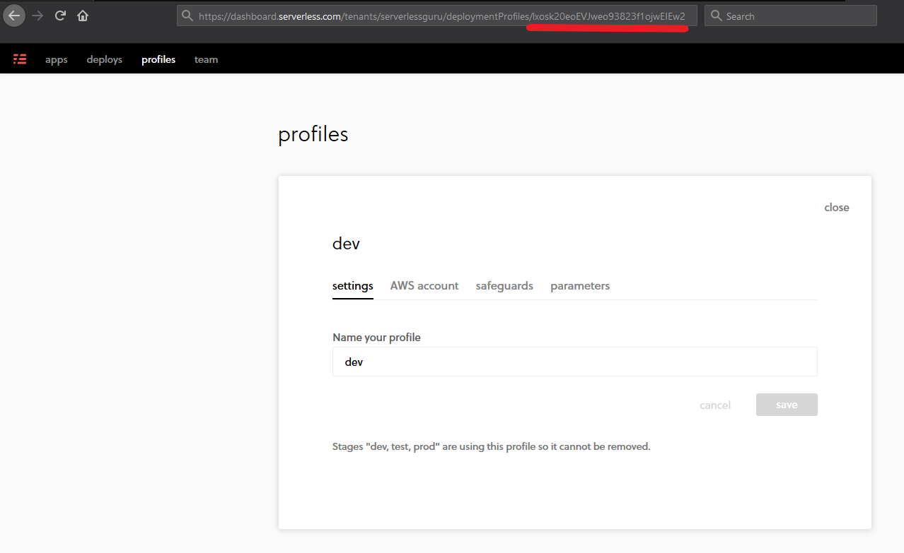
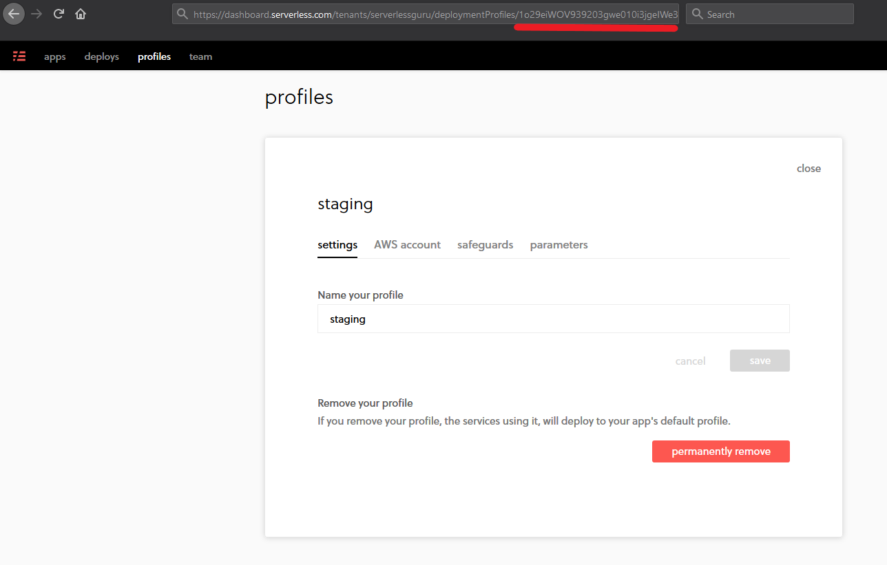

# Tutorial for Running Param Copy Function


* [Overview](#overview)

* [Env File Setup](#env-file-setup)

* [Run](#run)

## Overview

This tutorial explains how to duplicate params from one Serverless Pro profile to another. The Serverless Dashboard allows for unlimited params on a profile so on larger projects copying each line item to a new profile can be prohibitive. This template creates a local node.js environment that pulls an original profile, compares it to a new profile, and then pushes up a new list of combined params and safeguards.

More information on parameters can be found in the [Serverless Documenation](https://serverless.com/framework/docs/dashboard/parameters/). 

## Env File Setup

### 1. Add `SLS_ORG` to `.env` File

Your Serverless Dashboard organization can be found both in the top right corner and in the URL after `/tenants`:


This and all remaining variables will be added to the `.env` file like so:

```
SLS_ORG=serverlessguru
```

### 2. Add `FROM_PROFILE` to `.env` File

This is the ID of the Serverless profile you are looking to copy params *from*.

You can find this value by navigating to "Profiles" in the Serverless Dashboard and selecting the desired profile. Once there get the profile's ID from the URL:



### 3. Add `TO_PROFILE` to `.env` File

Follow the same process as step 1. You must have an existing profile to copy *to*, even if it's completely blank.



### 4. Add `TOKEN` to `.env` File

Our upcoming Serverless SDK calls require a personal access key. If you already one one go ahead and use that as your token, otherwise you can create a new one by navigating to "personal access keys" in your organization's dropdown menu:


From there click "add", type in a name for your key, and click "create". Copy the shown value both to `.env` and to your own secure location as this value will not be shown again.


## Run

### 1. Install Serverless

```
$ npm install -g serverless
```

### 2. Install Remaining Dependencies
```
$ npm install
```

### 3. Run the copyParams Script:
```
$ node -e 'require("./index").copyParams()'
```

This will run the wrapper function that pulls the To and From profiles using `getParams`, joins their safeguards and params using `joinArrays` (ignoring any duplicates provided by the From profile), and pushing the new values up using the `patchparams`. 

At this point your updates should be live!

